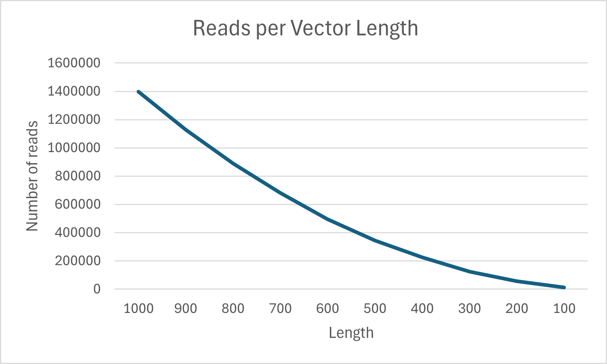
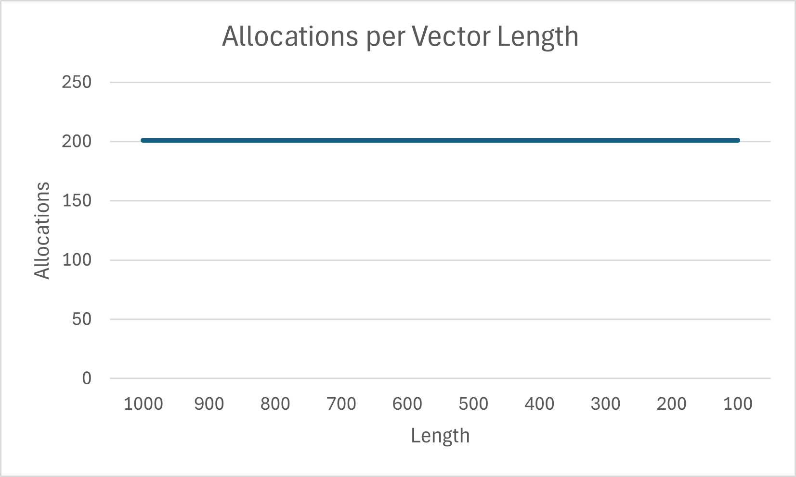
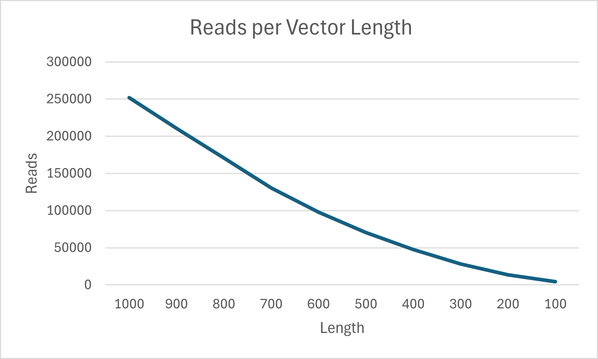
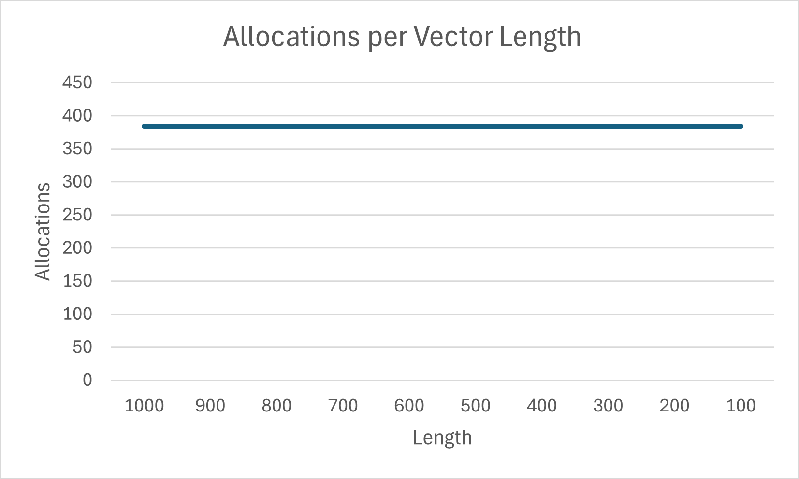
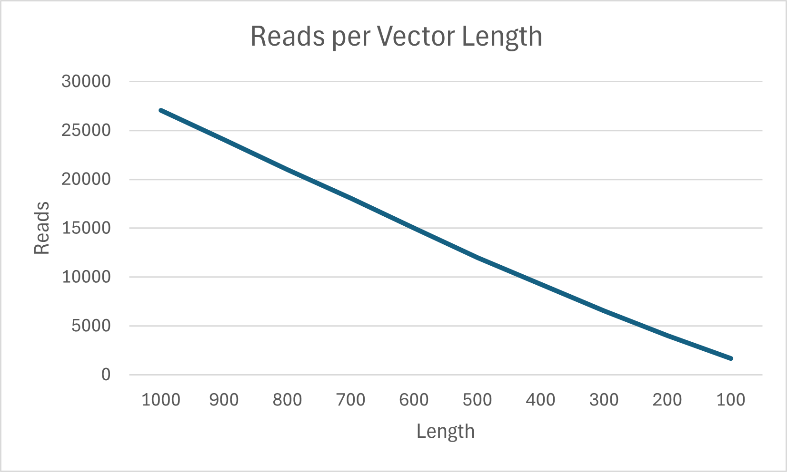
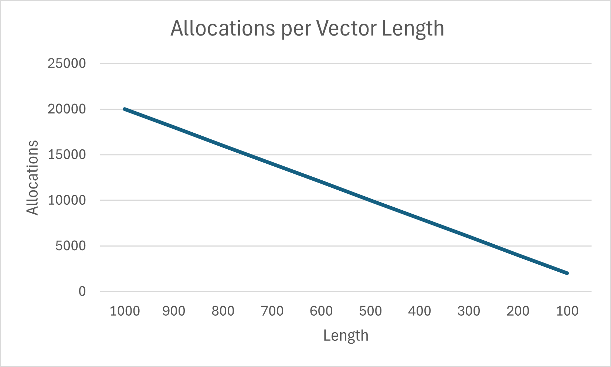
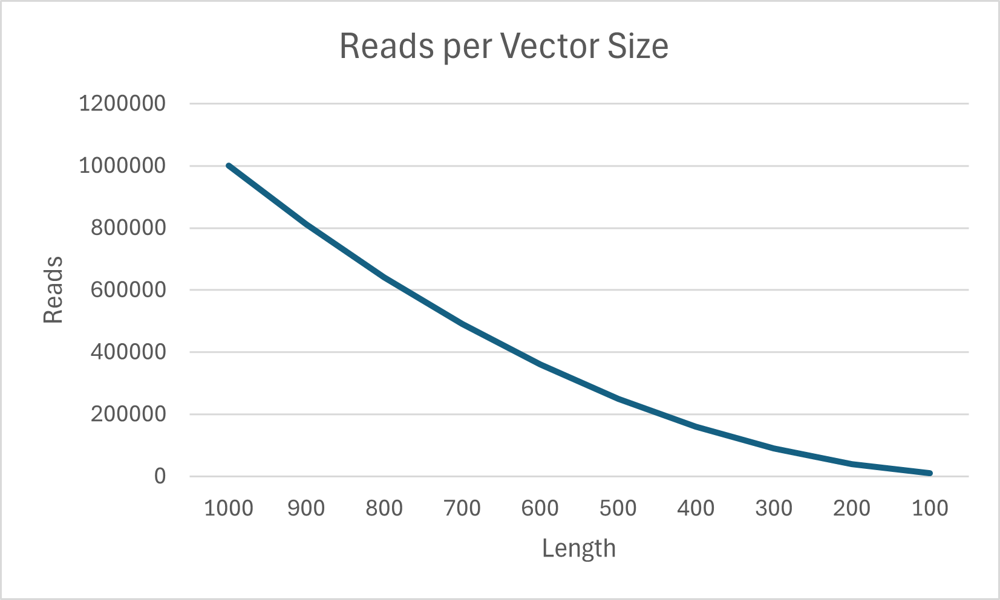
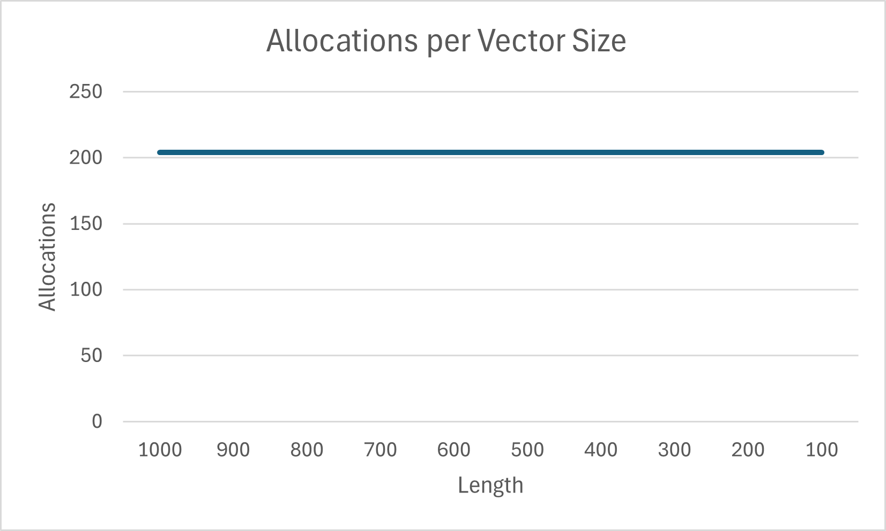

# Project 4 Report

The data set I used includes the order id, unit price, pizza size, ect. for pizza orders made in 2015.
Each order is a unique order someone made for one or more pizzas.
# Bubble Sort:

# Heap Sort:

# Merge Sort:

# Selection Sort:

Bubble, heap, and selection sort all had constant allocations no matter how large the data got. While
merge sort seemingly had a linear relationship with the length of the vector. As the length went down
merge sort required less memory allocation. This shows that bubble, heap, and selection sort all have
relatively similar constant space complexity and merge sort has more complex linear space complexity.
When looking at the number of reads for each of the sorting algorithms the number of reads appears to
increase at a quadratic rate for bubble, heap, and selection sort as the length of the vector goes up.
For merge sort the number of reads goes up linearly as the length of the vector increases.
This shows that merge sort has a better time complexity because it reads the data less often than the
other search algorithms; merge, heap, and selection sort. Bubble and selection sort also get up to over
a million reads when the vector length is 1,000 while heap sort only gets to around 250,000 reads.
This shows that bubble and selection sort both have similar time and space complexity. Heap sort has similar
space complexity to bubble and selection sort but has slightly better time complexity. Merge sort has much worse
space complexity than the other algorithms, but its time complexity is a lot better.

* Look at the output from the stabilityTest function and answer the following questions:
  * How are the names sorted by default?
    * By default, the names are sorted in alphabetical order.
  * How is the output from the two stable sorting algorithms different from the two unstable ones? Be specific in your answer, and use what you know about how each sorting algorithm works to justify your observations.
    * When the names are sorted alphabetically by last name they end up out of their original order when sorted with the unstable algorithms.
      When sorted by heap sort blake black ends up behind all the people with the last name black this is probably because he is the first
      person with the black last name in the default data. This would make him be further down in the heap tree when the algorithm is run.
      When sorted by selection sort the names Kelsey Brown and Jamie Brown are swapped. This is because when the algorithm was running it swapped
      Jamie Brown with another name.
      
* Answers to the following questions:
  * If you need to sort a contacts list on a mobile app, which sorting algorithm(s) would you use and why?
    * I would use selection, bubble, or heap sort because the stability doesn't matter that much for a contacts list.
      And they all have constant space complexity and someone likely won't have that many contacts so time complexity won't matter that much. 
  * What about if you need to sort a database of 20 million client files that are stored in a datacenter in the cloud?
    * I would use merge sort because it's stable, and it's worst possible time complexity is O(nLn(n)). The only downside
      is it's space complexity is linear.